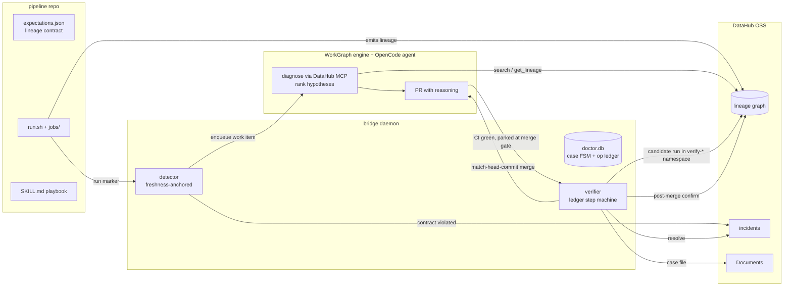

# AutoLineage

**Self-healing lineage for DataHub.** An autonomous agent that detects broken
Spark/Delta lineage against a declared contract, diagnoses the failure from
**live DataHub MCP evidence**, ships the fix as a CI-tested pull request,
validates the candidate in an isolated DataHub namespace **before** merging,
merges exactly the verified SHA, confirms the canonical graph healed, and writes
the incident + case record back into DataHub.

Built for [Build with DataHub: The Agent Hackathon](https://datahub.devpost.com)
(*Agents That Do Real Work*). Three real autonomous heals — three different
failure classes, one straight through a bridge crash — are documented with
original artifacts in [`examples/`](./examples/).

> Lineage doesn't fail loudly. It fails silently and erodes trust in the
> catalog: jobs stay green while edges go stale, or the graph floods with
> duplicate entities. AutoLineage treats the lineage graph as something with an
> SLA.

## How it works



1. **Detect** — `expectations.json` declares the lineage a pipeline must
   produce. Detection is *freshness-anchored*: after every pipeline run (a
   scheduler post-run hook pokes a run marker) the contract edge must have been
   re-observed. Structural existence alone can never catch a regression —
   yesterday's healthy edge lives in the graph forever. This also makes
   **silent pipelines** (job green, zero emissions) detectable.
2. **Diagnose** — the work item goes to a coding agent running under
   [workgraph](https://github.com/alucaptej/workgraph). The agent pulls live
   evidence through the **DataHub MCP server** (`search`, `get_lineage`,
   `get_entities`…), matches it against the
   [playbook](https://github.com/alucaptej/autolineage-demo-pipelines/blob/main/skills/datahub-lineage-debug/SKILL.md)'s
   evidence signatures, and opens a PR whose body states the evidence, the
   matched signature, and the chosen hypothesis. No documented mode matching →
   it must escalate (`blocked`), not guess.
3. **Verify, then merge** — the bridge never trusts a green PR: it re-fetches
   the live head OID (aborts on force-push), requires CI green *for that OID*,
   runs the candidate SHA in an isolated DataHub namespace
   (`platformInstance=verify-<case>`) with the repo's own defaults under test,
   and only then merges — `gh pr merge --match-head-commit <verified-OID>`.
   A post-merge run must turn the *canonical* contract fresh-green before the
   incident is resolved and the case Document is filed.
4. **Exactly-once write-back** — every external mutation goes through an
   operations ledger (inflight-row-before-call + deterministic
   `[autolineage:<case>]` markers + startup reconciliation). Proven by
   `kill -9` rehearsal: the engine reached its terminal state during the
   outage, the restarted bridge resumed from the ledger, and every operation
   kind executed exactly once.

## Run it

Prereqs: Docker (≈9 GB for the VM), [bun](https://bun.sh), Python 3.10–3.12,
JDK 17, `gh` authenticated, an Anthropic (or other OpenCode-supported) API key.

```sh
# 1) DataHub OSS + token
pipx install acryl-datahub && datahub docker quickstart
# create a PAT (UI → Settings → Access Tokens), then:
printf 'DATAHUB_GMS_URL=http://localhost:8080\nDATAHUB_GMS_TOKEN=<token>\n' > ~/hack/.env.datahub

# 2) MCP server for the agent (wrapper keeps the token out of opencode.json)
uv tool install mcp-server-datahub
# point opencode's mcp config at a wrapper that sources the env file — see docs/engine-interface.md

# 3) the three repos side by side
gh repo clone alucaptej/autolineage && gh repo clone alucaptej/autolineage-demo-pipelines && gh repo clone alucaptej/workgraph
cd autolineage-demo-pipelines && python3.12 -m venv .venv && .venv/bin/pip install "pyspark==3.5.6" "delta-spark==3.3.2" ruff pytest && cd ..
cd workgraph && bun install && cd ../autolineage && bun install

# 4) configure paths in bridge.config.json, then
make check        # startup probes must be green
make up           # serve + engine + bridge
make -C ../autolineage-demo-pipelines run BRIDGE_DIR=$PWD   # healthy baseline

# 5) the show
make demo-break   # plant the regression + run the broken pipeline
# … watch: incident appears in DataHub → agent PR with reasoning → verified merge → healed
make verify-loop  # machine-checked definition-of-done
```

`bun test` runs the bridge suite (golden fixtures, FSM legality, ledger
idempotency — no network needed). Engine interface details:
[`docs/engine-interface.md`](./docs/engine-interface.md).

## Honest limitations

- One expectation/pipeline in the demo; the detector generalizes, the demo doesn't.
- The escalate-instead-of-guess path is enforced by playbook + safety floor
  (no PR from a failed case has ever merged; orphaned gates are swept), but we
  have not yet produced a break the agent *couldn't* legitimately fix — both
  attempts were out-engineered (see `examples/`, heal 2).
- Candidate validation shares the target DataHub instance (isolated by
  platformInstance namespace, not a separate deployment).
- No metadata deletion anywhere, by design — fragments created by broken runs
  remain as historical evidence.

## Repos

| repo | role |
|---|---|
| [autolineage](https://github.com/alucaptej/autolineage) | bridge, verification, write-back, examples (this repo) |
| [autolineage-demo-pipelines](https://github.com/alucaptej/autolineage-demo-pipelines) | PySpark/Delta demo target; the agent's merged PRs are in its history |
| [workgraph](https://github.com/alucaptej/workgraph) | agent work-item engine (pre-existing, disclosed — see [DISCLOSURE.md](./DISCLOSURE.md)) |

## License

[Apache-2.0](./LICENSE)
